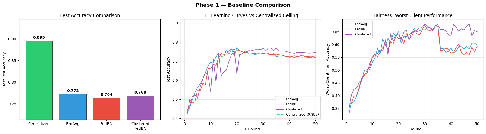
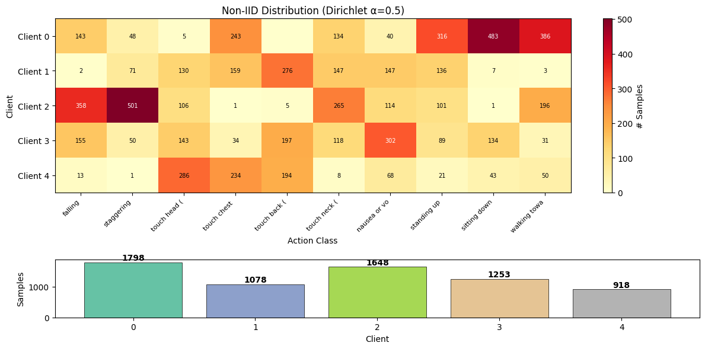
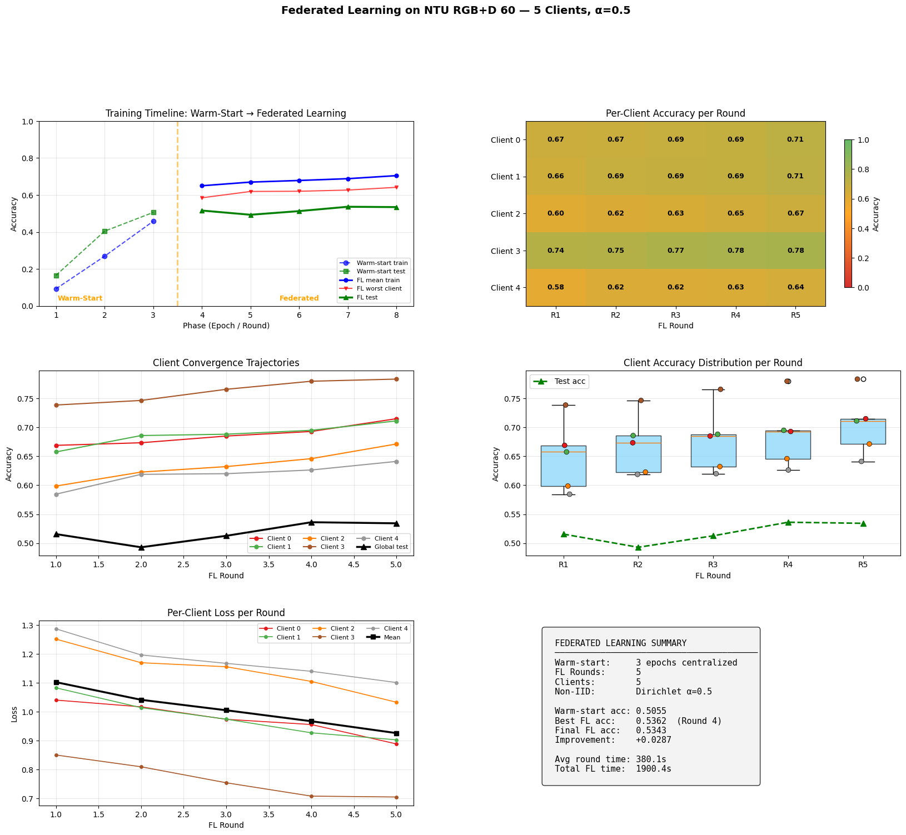

<!-- _class: lead -->

# Federated Medical Action Recognition
## Privacy-Preserving Skeleton-Based HAR for Patient Monitoring

**Research Progress Update**

---

# Research Scope

## Two High-Level Goals

**Goal 1 — Personalized Federated Learning**
Close the accuracy gap between centralized and federated training by applying personalized FL (PFL) methods to skeleton-based medical HAR

**Goal 2 — Multimodal Fusion**
Investigate whether combining skeleton data with inertial (IMU) signals improves recognition of medical actions

## What We Cover in This Update

- Baseline experiments establishing the centralized–federated gap
- Quick-scan comparison of 5 PFL methods (FedAvg, FedBN, FedProx, Ditto, FedRep)
- First multimodal experiment: skeleton-only vs. late fusion with synthetic IMU
- Analysis of findings and next steps for both goals

---

# Problem & Motivation

**Setting:** Medical HAR for patient monitoring and emergency notification across hospitals — recognising actions like falling, staggering, or pain gestures that indicate a medical emergency

**Challenge:** Patient data cannot be centralized due to privacy regulations → **Federated Learning**

- Skeleton-based input avoids facial/identity capture (privacy by design)
- FL keeps raw data on-device — only model weights traverse the network

| Component | Detail |
|-----------|--------|
| Model | STGCN++ (6 GCN blocks, 443K params, COCO-17) |
| FL Setup | 5 simulated hospital clients, Dirichlet α=0.5 (non-IID) |
| Training | SGD lr=0.01, warm-start 2 epochs, Flower framework |
| Data | NTU RGB+D 60 medical subset — Train: 6,695 · Test: 2,749 |
| Deployment | ONNX export → 15–20 FPS CPU inference |

**10 medical classes:** falling, staggering, touch head/chest/back/neck, nausea, standing up, sitting down, walking

---

# Preliminary Research — Goal 1: Personalized FL

## Literature Context

Standard FL methods (FedAvg, FedBN) struggle under non-IID data distributions. Personalized FL (PFL) methods address this by tailoring models to each client.

**Key references surveyed:**
- **FedCFE** (IEEE IoT Journal 2026) — comprehensive PFL benchmark; guided our method selection
- **FedProx** (MLSys 2020) — adds proximal term $\frac{\mu}{2}\|w - w_g\|^2$ to constrain client drift
- **Ditto** (ICML 2021) — trains separate personal models regularized toward the global model
- **FedRep** (ICML 2021) — shared representation body + local classification head
- **APFL** (arXiv 2020) — adaptive interpolation between local and global models

**Method selection rationale:** We deprioritized Per-FedAvg (2× compute), FedALA (complex channel attention), and FedCFE (cite-only) in favour of methods with favourable accuracy/overhead trade-offs.

---

# Preliminary Research — Goal 2: Multimodal Fusion

## Literature Context

Recent work shows that combining skeleton with inertial measurement unit (IMU) data can improve HAR performance, especially for medical actions involving subtle body movements.

**Key references:**
- **IMUTube** (IMWUT 2021, 216 cites) — generates virtual IMU from video; validates synthetic IMU for HAR
- **SmartFallMM** (2025) — multimodal fall detection framework combining skeleton + accelerometer
- **SynHAR** (2024) — synthetic sensors for cross-modal transfer learning
- **Duhme et al.** (GCPR 2021) — **Fusion-GCN**: embeds IMU as virtual graph nodes in GCN skeleton, reported +12.4% F1

**Our synthetic IMU approach:**
$$a(t) = \frac{p(t+1) - 2p(t) + p(t-1)}{\Delta t^2}$$
Physics-based acceleration derived from NTU 3D skeleton joint positions, with Butterworth filtering and Gaussian noise injection.

---

# Baseline Results — Phase 1 (50 Rounds)

**4 methods, 50 rounds each, Colab T4, ~3.8 hours total**

| Method | Best Acc | Final Acc (R50) | Δ vs Centralized | Worst Client |
|--------|----------|-----------------|-------------------|--------------|
| **Centralized** | **89.49%** | **88.07%** | — (ceiling) | — |
| FedAvg | 77.19% | 71.95% | −12.30 pp | 59.91% |
| FedBN | 76.36% | 72.64% | −13.13 pp | 59.26% |
| Clustered FedBN | 76.83% | 74.61% | −12.66 pp | **65.03%** |

**Key findings:**
1. **12–13 pp FL gap** — substantial room for improvement
2. **All methods degrade after R20** — peak early then decline (client drift)
3. **FedAvg slightly > FedBN** — α=0.5 heterogeneity may be too mild for BN localization
4. **Clustered FedBN**: best final accuracy (74.6%) and fairness (worst client 65.0%), but clustering collapsed to isolate client 4

---

# Baseline Convergence Dynamics

| Method | R10 | R20 (peak) | R30 | R50 |
|--------|-----|------------|-----|-----|
| FedAvg | 69.4% | **77.2%** | 73.8% | 72.0% |
| FedBN | 65.9% | 75.7% | 74.1% | 72.6% |
| Clustered FedBN | 53.9% | 63.3% | **76.5%** | 74.6% |

**Hypothesis:** Client drift causes post-R20 degradation → PFL methods that constrain drift (FedProx) or personalize models (Ditto, FedRep) should help.

---

# PFL Quick-Scan Results — Goal 1 (10 Rounds)

**5 methods, 10 rounds each, warm-start from 2 pre-trained epochs, Colab T4**

| Method | Best Acc (10R) | R5 Acc | R10 Acc | Time |
|--------|---------------|--------|---------|------|
| FedAvg | 70.83% | 67.26% | 65.70% | 843 s |
| FedBN | 71.88% | 67.15% | 71.26% | 841 s |
| **FedProx** | **73.41%** | 64.93% | **73.41%** | 883 s |
| Ditto | 71.34% | — | 70.50% (global) | 1,882 s |
| FedRep | 64.05% | 60.91% | 64.05% | 1,348 s |

**FedProx is the clear winner** (+2.58 pp over FedAvg, +1.53 pp over FedBN) with minimal overhead.

*Note: APFL not yet run due to time constraints. Comparison chart pending.*

---

# PFL Quick-Scan Analysis

## FedProx Leads

- Proximal regularization ($\mu=0.01$) effectively constrains client drift
- FedProx **still improving at R10** (73.41%) while FedAvg already declining (65.70% at R10)
- Negligible compute overhead vs FedAvg (+40 s over 10 rounds)

## Other Observations

- **Ditto** achieves 71.34% but at **2.2× compute cost** — personal models need more rounds to converge
- **FedRep** underperforms (64.05%) — only 10 rounds is likely insufficient for representation–head decoupling to work
- **FedBN** improves over baseline FedAvg in this shorter run (71.88% vs 70.83%)

## What Remains (Goal 1)

- Full 50-round evaluation of FedProx (expected to reach ~78–80%+)
- APFL quick scan for completeness
- Per-class F1 analysis on best method (especially fall recall for safety)

---

# Multimodal Fusion Results — Goal 2

**Centralized experiment: Skeleton-only vs. Late Fusion with synthetic IMU**

| Model | Input | Params | Test Accuracy |
|-------|-------|--------|---------------|
| Skeleton-only (STGCN++) | $(N,2,100,17,3)$ | 443K | **79.3%** |
| Late Fusion (STGCN++ + 1D-CNN) | Skeleton + IMU 6ch | 493K | 77.3% |

**Result: Synthetic IMU hurt performance by −2.0 pp**

**Analysis:** The synthetic IMU is derived as $a(t) = f(\text{skeleton})$ — it is a deterministic function of the skeleton input. The 1D-CNN IMU encoder cannot learn features that are not already available to the GCN from the skeleton itself. The additional parameters and optimization complexity degraded performance.

## What Remains (Goal 2)

- **Fusion-GCN** (designed, not yet run): embed IMU as 4 virtual nodes in an extended 21-joint skeleton graph — this approach avoids the redundancy problem by integrating IMU features directly into the graph structure
- Exploration with real (non-synthetic) IMU data from complementary datasets

---

# Summary of Results

| Experiment | Key Finding |
|------------|-------------|
| **Centralized baseline** | 89.49% — performance ceiling |
| **FL baselines (50R)** | Best: FedAvg 77.19% — 12.3 pp gap, degradation after R20 |
| **PFL quick scan (10R)** | **FedProx 73.41%** — best PFL method, +2.58 pp over FedAvg |
| **Multimodal v1** | Late Fusion 77.3% < Skeleton-only 79.3% — synthetic IMU is redundant |

### Progress Overview

| Work Area | Status |
|-----------|--------|
| FL infrastructure + ONNX pipeline | ✅ Complete |
| Phase 1: Baseline experiments (50 rounds) | ✅ Complete |
| PFL quick scan (5 of 6 methods) | ✅ Complete |
| Multimodal v1: Late Fusion experiment | ✅ Complete |
| Full 50-round evaluation of FedProx | Planned |
| APFL quick scan | Planned |
| Multimodal v2: Fusion-GCN | Designed, not yet run |

---

# Next Steps

### Goal 1 — Personalized FL (Priority)
1. **Full 50-round FedProx run** — confirm quick-scan advantage at scale
2. Run APFL to complete the PFL method survey
3. Per-class F1 analysis on best method — assess safety-critical action recall (fall, stagger)
4. Investigate lower Dirichlet α (e.g., α=0.1) to test under stronger heterogeneity

### Goal 2 — Multimodal Fusion
1. Run **Fusion-GCN** experiment — IMU as virtual graph nodes in extended 21-joint skeleton
2. If Fusion-GCN shows improvement, combine with FL (federated multimodal)
3. Explore real IMU datasets (UTD-MHAD, SmartFallMM) for non-synthetic validation

### Open Questions
- Is the post-R20 accuracy degradation primarily a LR schedule issue or fundamental client drift?
- Can FedProx's advantage scale to 50 rounds, or will drift still dominate long-term?
- Would physical IMU signals (not derived from skeleton) provide complementary information?

---

<!-- _class: lead -->

# Backup Slides

---

# Data Distribution Across Clients

5 clients, Dirichlet α=0.5. Client sizes: 1798, 1078, 1648, 1253, 918.

---

# FL Training Dynamics (Phase 1)

4-panel analysis: accuracy timeline, client heatmap, loss curves, summary.

---

# Centralized Training Curve

| Epoch | Loss | Train Acc | Test Acc |
|-------|------|-----------|----------|
| 1 | 2.174 | 27.4% | 29.0% |
| 5 | 0.547 | 79.6% | 79.0% |
| 10 | 0.271 | 90.0% | 75.7% |
| 15 | 0.181 | 93.7% | 86.2% |
| 20 | 0.166 | 94.2% | **88.1%** |

Best test accuracy: **89.49%** (between epoch 15-20). Overfitting gap: 94.2% train vs 88.1% test at epoch 20.

---

# Clustering Behavior — Clustered FedBN

| Round | Client 0 | Client 1 | Client 2 | Client 3 | Client 4 |
|-------|----------|----------|----------|----------|----------|
| R1 | 1 | 0 | 1 | 0 | 1 |
| R10 | 0 | 0 | 0 | 0 | **1** |
| R20–R50 | 0 | 0 | 0 | 0 | **1** |

Clusters collapsed after R10 — client 4 (smallest, 918 samples) isolated.
Despite collapse, Clustered FedBN achieved best **final** accuracy and **fairness**.

---

# PFL Methods — Implementation Details

| Method | Core Mechanism | Memory | Communication |
|--------|---------------|--------|---------------|
| FedProx | Proximal term $\frac{\mu}{2}\|w - w_g\|^2$ | 1× model | 1× (same as FedAvg) |
| Ditto | Personal model + L2 reg toward global | 2× model (~900K) | 1× (only global) |
| FedRep | Shared body (440K) + local head (2.6K) | 1× model | 0.994× (exclude head) |
| APFL | Adaptive α mixing: local ↔ global | 2× model + α | 1× (only global) |

Implementations adapted from PFLlib (TsingZ0/PFLlib, JMLR, Apache 2.0).

---

# Late Fusion Architecture (Multimodal v1)

| Stream | Backbone | Output Dim |
|--------|----------|------------|
| Skeleton $(N,2,100,17,3)$ | STGCN++ (443K) | 256-d |
| IMU $(N,6,100)$ | 1D-CNN (50K) | 128-d |
| **Fusion** | Concat → FC(384, 10) | 10 classes |

Synthetic IMU from 2 virtual sensors: right wrist (hand gestures) + waist (falls/gait) → 6 channels.
**Finding:** Redundant — IMU is $f(\text{skeleton})$, provides no new information to the model.

---

# Fusion-GCN — Planned Multimodal v2

**Approach:** Extend the COCO-17 skeleton graph with 4 virtual IMU nodes

- IMU sensors at: both wrists (joints 9, 10), waist (joint 0), ankle (joint 15)
- Extended graph: 21 nodes with IMU-to-joint adjacency edges
- STGCN++ processes skeleton + IMU jointly in a single graph

**Advantage over late fusion:** Information is integrated at the graph-convolution level rather than feature concatenation — avoids the redundancy problem observed in v1.

Reference: Duhme et al. (GCPR 2021) reported +12.4% F1 with this approach.
